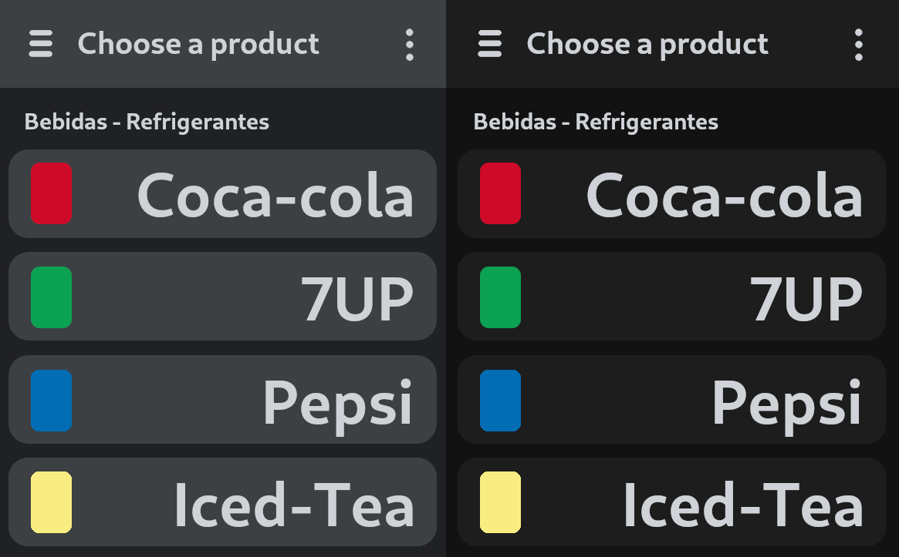

# openCX-DroneYourFood Development Report

Welcome to the documentation pages of the _Drone your Food_ of **openCX**!

You can find here detailed about the (sub)product, hereby mentioned as module,
from a high-level vision to low-level implementation decisions, a kind of
Software Development Report (see
[template](https://github.com/softeng-feup/open-cx/blob/master/docs/templates/Development-Report.md)
), organized by discipline (as of RUP):

- Business modeling
  - [Product Vision](#Product-Vision)
  - [Elevator Pitch](#Elevator-Pitch)
- Requirements
  - [Use Case Diagram](#Use-case-diagram)
  - [User stories](#User-stories)
  - [Domain model](#Domain-model)
- Architecture and Design
  - [Logical architecture](#Logical-architecture)
  - [Physical architecture](#Physical-architecture)
  - [Prototype](#Prototype)
- [Implementation](#Implementation)
- [Test](#Test)
- [Configuration and change management](#Configuration-and-change-management)
- [Project management](#Project-management)

So far, contributions are exclusively made by the initial team, but we hope to
open them to the community, in all areas and topics: requirements, technologies,
development, experimentation, testing, etc.

Please contact us!

Thank you!

Made By:

- Ana Barros
- João Martims
- João Costa
- Ricardo Fontão

---

## Product Vision

Deliver food quickly and seamlessly to conference participants.

---

## Elevator Pitch

Conference participants waste a lot of time in lines and changing seats when getting
food. Our company helps them feel more immersed in the conference by quickly
and confortably delivering food and beverages just with a few taps on their phones.
What makes our approach unique is the use of new drone technology to bypass any
obstacle and make deliveries as fast as possible.

---

## Requirements

In this section, you should describe all kinds of requirements for your module:
functional and non-functional requirements.

Start by contextualizing your module, describing the main concepts, terms, roles,
scope and boundaries of the application domain addressed by the project.

### Use case diagram


- **Actor** - Conference participant.
- **Description** - The actor chooses some products and orders them.
- **Preconditions** - The actor has to have an account on our service and be
  able to pay for the order.
- **Postconditions** - A drone will receive instructions to deliver the
  order to the actor.
- **Normal Flow** - TODO Provide a detailed description of the user actions and system responses that will take place during execution of the use case under normal, expected conditions. This dialog sequence will ultimately lead to accomplishing the goal stated in the use case name and description. This is best done as a numbered list of actions performed by the actor, alternating with responses provided by the system.
- **Alternative Flows and Exceptions** - TODO Document other, legitimate usage scenarios that can take place within this use case, stating any differences in the sequence of steps that take place. In addition, describe any anticipated error conditions that could occur during execution of the use case, and define how the system is to respond to those conditions.

### User stories

#### User story 1



_As a customer, I want to consult the products available for sale._

- **Value = Must Have**
- **Effort = M**

```gherkin
Feature: Consulting available products.
Given: I am a DroneYourFood user.
And: I am logged in.
When: I am on the products page.
Then: I see the available products.
```

#### User story 2


_As a customer, I must log in into my account to place orders._

- **Value = Must Have**
- **Effort = M**

```gherkin
 Feature: Login functionality.
 Given: I have a registered account in DroneYourFood.
 When: I enter username as username.
 And: I enter the password as the password
 Then: I should be redirected to the products page of DroneYourFood.
```

#### User story 3


_As a customer, I want to be able to order food/drinks from the available products._

- **Value = Must Have**
- **Effort = L**

```gherkin
 Feature: Select orders.
 Given: I am logged in.
 When: I am on the products page.
 Then: Selected products must be added to cart.
```

#### User story 4

_As a customer, I want to have food delivered to me, so I don't have to get up
from my seat._

- **Value = Should Have**
- **Effort = XL**

```gherkin
 Feature: Deliver the order.
 Given: The order has been placed.
 When: The order is ready for delivery.
 Then: The drone brings the food to the selected place.
```

#### User story 5

_As a customer, I want to have multiple payment methods available to me._

- **Value = Won't Have**
- **Effort = XL**

```gherkin
 Feature: Select payment method.
 Given: I have specified my order details.
 When: I am on the checkout page.
 Then: I can select the payment method.
 And: I can finish paying for my order.
```

#### User story 6

_As a customer, I want to be able to choose the delivery spot for my orders._

- **Value = Could Have**
- **Effort = M**

```gherkin
 Feature: Select delivery place.
 Given: I have finished selecting all the products I want to order.
 When: I am on the checkout page.
 Then: I register the order delivery spot.
```

#### User story 7

_As a customer, I want to be able to change my order._

- **Value = Could Have**
- **Effort = S**

```gherkin
 Feature: Change order.
 Given: I have placed an order.
 When: I am on the checkout page.
 Then: I go back to the objects page.
```

#### User story 8

- **Value = Could Have**
- **Effort = S**

_As a customer, I want to be able to cancel my order._

```gherkin
 Feature: Cancel order.
 Given: I have placed an order.
 When: I am on the checkout page.
 Then: I cancel my order.
```

TODO
**INVEST in good user stories**.
You may add more details after, but the shorter and complete, the better. In
order to decide if the user story is good, please follow the
[INVEST guidelines](https://xp123.com/articles/invest-in-good-stories-and-smart-tasks/).

**User interface mockups**.
After the user story text, you should add a draft of the corresponding user
interfaces, a simple mockup or draft, if applicable.

**Acceptance tests**.
For each user story you should write also the acceptance tests (textually in
Gherkin), i.e., a description of scenarios (situations) that will help to
confirm that the system satisfies the requirements addressed by the user story.

**Value and effort**.
At the end, it is good to add a rough indication of the value of the user story
to the customers (e.g. [MoSCoW](https://en.wikipedia.org/wiki/MoSCoW_method)
method) and the team should add an estimation of the effort to implement it,
for example, using t-shirt sizes (XS, S, M, L, XL).

### Domain model

TODO
To better understand the context of the software system, it is very useful to
have a simple UML class diagram with all the key concepts (names, attributes)
and relationships involved of the problem domain addressed by your module.

---

## Architecture and Design

TODO

The architecture of a software system encompasses the set of key decisions
about its overall organization.

A well written architecture document is brief but reduces the amount of time
it takes new programmers to a project to understand the code to feel able to
make modifications and enhancements.

To document the architecture requires describing the decomposition of the
system in their parts (high-level components) and the key behaviors and
collaborations between them.

In this section you should start by briefly describing the overall components
of the project and their interrelations. You should also describe how you solved
typical problems you may have encountered, pointing to well-known architectural
and design patterns, if applicable.

### Logical architecture

The purpose of this subsection is to document the high-level logical structure
of the code, using a UML diagram with logical packages, without the worry of
allocating to components, processes or machines.

It can be beneficial to present the system both in a horizontal or vertical
decomposition:

- horizontal decomposition may define layers and implementation concepts, such
  as the user interface, business logic and concepts;
- vertical decomposition can define a hierarchy of subsystems that cover all
  layers of implementation.

### Physical architecture

The goal of this subsection is to document the high-level physical structure
of the software system (machines, connections, software components installed,
and their dependencies) using UML deployment diagrams or component diagrams
(separate or integrated), showing the physical structure of the system.

It should describe also the technologies considered and justify the selections
made. Examples of technologies relevant for openCX are, for example, frameworks
for mobile applications (Flutter vs ReactNative vs ...), languages to program
with microbit, and communication with things (beacons, sensors, etc.).

### Prototype

Regarding the technologies we will be using on the development of our application, we decided to use Flutter because it is easy to use and easy to learn. It is also used in open-cx making the app easier to integrate if necessary. For the authentication part of the application we decided to go with Firebase because it is free and easy to integrate. It will also be used to store all of the product data. For the drones we will be using a python server but the implementation details are still being discussed.

At the end of our [first iteration](https://github.com/FEUP-ESOF-2020-21/open-cx-t1g3-pantufas/releases/tag/v0.1) we have implemented the user story "As a customer, I want to consult the products available for sale.". This gave us some basic understanding of Flutter and serves as a very early prototype of what the application will be. In this iteration we have used JSON instead of Firebase to store our product data but this will be changed later. The prototype also contains a basic theme we intend to use but still needs some improvements.


## Implementation

Regular product increments are a good practice of product management.

While not necessary, sometimes it might be useful to explain a few aspects
of the code that have the greatest potential to confuse software engineers
about how it works. Since the code should speak by itself, try to keep this
section as short and simple as possible.

Use cross-links to the code repository and only embed real fragments of code
when strictly needed, since they tend to become outdated very soon.

---

## Test

There are several ways of documenting testing activities, and quality assurance
in general, being the most common: a strategy, a plan, test case specifications,
and test checklists.

In this section it is only expected to include the following:

- test plan describing the list of features to be tested and the testing methods
and tools;
- test case specifications to verify the functionalities, using unit tests and
acceptance tests.

**// TODO ASK SE É MESMO PRECISO UNIT TESTS**

A good practice is to simplify this, avoiding repetitions, and automating the
testing actions as much as possible.

---

## Configuration and change management

Configuration and change management are key activities to control change to,
and maintain the integrity of, a project’s artifacts (code, models, documents).

For the purpose of ESOF, we will use a very simple approach, just to manage
feature requests, bug fixes, and improvements, using GitHub issues and
following the [GitHub flow](https://guides.github.com/introduction/flow/).

---

## Project management

We are using _Github Projects_ to manage our tasks. Use this
[link](https://github.com/FEUP-ESOF-2020-21/open-cx-t1g3-pantufas/projects/1)
to check what we are up to.

---

## Evolution - contributions to open-cx

Describe your contribution to open-cx (iteration 5), linking to the appropriate
pull requests, issues, documentation.
