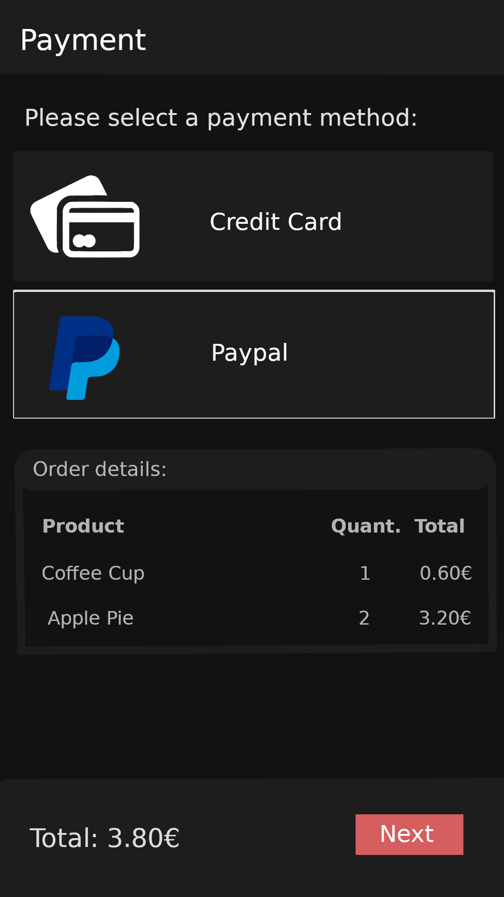

# openCX-DroneYourFood Development Report

Welcome to the documentation pages of the _Drone your Food_ of **openCX**!

You can find here detailed about the (sub)product, hereby mentioned as module,
from a high-level vision to low-level implementation decisions, a kind of
Software Development Report (see
[template](https://github.com/softeng-feup/open-cx/blob/master/docs/templates/Development-Report.md)
), organized by discipline (as of RUP):

- Business modeling
  - [Product Vision](#Product-Vision)
  - [Elevator Pitch](#Elevator-Pitch)
- Requirements
  - [Use Case Diagram](#Use-case-diagram)
  - [User stories](#User-stories)
  - [Domain model](#Domain-model)
- Architecture and Design
  - [Logical architecture](#Logical-architecture)
  - [Physical architecture](#Physical-architecture)
  - [Prototype](#Prototype)
- [Implementation](#Implementation)
- [Test](#Test)
- [Configuration and change management](#Configuration-and-change-management)
- [Project management](#Project-management)

So far, contributions are exclusively made by the initial team, but we hope to
open them to the community, in all areas and topics: requirements, technologies,
development, experimentation, testing, etc.

Please contact us!

Thank you!

Made By:

- Ana Barros
- João Martims
- João Costa
- Ricardo Fontão

---

## Product Vision

Deliver food quickly and seamlessly to conference participants.

---

## Elevator Pitch

Conference participants waste a lot of time in lines and changing seats when getting
food. Our company helps them feel more immersed in the conference by quickly
and confortably delivering food and beverages just with a few taps on their phones.
What makes our approach unique is the use of new drone technology to bypass any
obstacle and make deliveries as fast as possible.

---

## Requirements

In this section, you should describe all kinds of requirements for your module:
functional and non-functional requirements.

Start by contextualizing your module, describing the main concepts, terms, roles,
scope and boundaries of the application domain addressed by the project.

### Use case diagram

- **Actor** - Conference participant.
- **Description** - The actor chooses some products and orders them.
- **Preconditions** - The actor has to have an account on our service and be
  able to pay for the order.
- **Postconditions** - A drone will receive instructions to deliver the
  order to the actor.
- **Normal Flow** - TODO Provide a detailed description of the user actions and system responses that will take place during execution of the use case under normal, expected conditions. This dialog sequence will ultimately lead to accomplishing the goal stated in the use case name and description. This is best done as a numbered list of actions performed by the actor, alternating with responses provided by the system.
- **Alternative Flows and Exceptions** - TODO Document other, legitimate usage scenarios that can take place within this use case, stating any differences in the sequence of steps that take place. In addition, describe any anticipated error conditions that could occur during execution of the use case, and define how the system is to respond to those conditions.


### User stories

#### User story map


#### User story 1


_As a customer, I want to consult the products available for sale._

- **Value = Must Have**
- **Effort = M**


```gherkin
Feature: Consulting available products.

  Scenario: Available products are present when the user taps the products list button
  Given I am logged in
  And I am in the "home" page
  When I am tap the "products list" button
  Then I expect the available products to be present

  Scenario: Product categories are present when the user taps the category list button
  Given I am logged in
  And I am in the "home" page
  When I tap the "category list" button
  Then I expect the "available products" categories to be present

  Scenario: Products of a certain category are present when I tap the button of that category
  Given I am logged in
  And I am on the "category list" page
  When I tap a "category" button
  Then I expect the available products from that category to be present
```


#### User story 2
_As a customer, I must log in into my account to place orders._
- **Value = Must Have**
- **Effort = M**


```gherkin
 Feature: Log In 
 Scenario: The user inputs his email and password to log in
 Given: I have a registered account in DroneYourFood
 When: I enter my email.
 And: I enter my password
 Then: I should be redirected to the "home" page
```

```gherkin
 Feature: Sign In 
 Scenario: The user inputs his email and password to sign in
 Given I am not logged in
 When I enter an email
 And I enter an password
 Then my account should be created
```

#### User story 3

_As a customer, I want to be able to order food/drinks from the available products._

- **Value = Must Have**
- **Effort = L**


```gherkin
 Feature: Add products to cart.
 Scenario: the product is added to the user's cart when it is tapped
 Given I am logged in
 And I am on the "products list" page
 When I tap a "product" card
 Then that product should be added to my cart
 And the text "Added product to cart" should be present
```

#### User story 4

_As a customer, I want to have food delivered to me, so I don't have to get up
from my seat._

- **Value = Should Have**
- **Effort = XL**

>

```gherkin
 Feature: Receive the order.
 Scenario: the user receives the food after the order has been placed
 Given the order has been placed
 When the order is ready for delivery
 Then the drone brings the food to the selected place
```

#### User story 5

_As a customer, I want to be able to check my profile._

- **Value = Should Have**
- **Effort = S**


```gherkin
 Feature: Check profile.
 Scenario: User can navigate to his profile page by tapping the profile button
 Given I am logged in
 When I press the profile button
 Then my profile's page is loaded
```

#### User story 6

_As a customer, I want to have multiple payment methods available to me._

- **Value = Won't Have**
- **Effort = XL**



```gherkin
 Feature: Select payment method.
 Scenario: The user selects a payment method by tapping the desired method 
 Given I have specified my order details
 When I tap a payment method
 Then I can use that method to pay for my order
```

#### User story 7

_As a customer, I want to be able to choose the delivery spot for my orders._

- **Value = Could Have**
- **Effort = M**


```gherkin
 Feature: Select delivery place.
 Scenario: The user selects a place 
 Given I have placed an order
 When I am on the checkout page
 Then I select the order delivery spot
```

#### User story 8

_As a customer, I want to be able to change my order._

- **Value = Could Have**
- **Effort = S**


```gherkin
 Feature: Change order.
 Scenario: The user changes the order after placing one 
 Given I have placed an order
 When I am on the checkout page
 Then I go back to the cart page
```

#### User story 9

_As a customer, I want to be able to cancel my order._

- **Value = Could Have**
- **Effort = S**


```gherkin
 Feature: Cancel order.
 Scenario: The user cancels the order after placing one
 Given I have placed an order.
 When I am on the checkout page
 Then I cancel my order
```

### Domain model


TODO
To better understand the context of the software system, it is very useful to
have a simple UML class diagram with all the key concepts (names, attributes)
and relationships involved of the problem domain addressed by your module.

---

## Architecture and Design

TODO

The architecture of a software system encompasses the set of key decisions
about its overall organization.

A well written architecture document is brief but reduces the amount of time
it takes new programmers to a project to understand the code to feel able to
make modifications and enhancements.

To document the architecture requires describing the decomposition of the
system in their parts (high-level components) and the key behaviors and
collaborations between them.

In this section you should start by briefly describing the overall components
of the project and their interrelations. You should also describe how you solved
typical problems you may have encountered, pointing to well-known architectural
and design patterns, if applicable.

### Logical architecture

The purpose of this subsection is to document the high-level logical structure
of the code, using a UML diagram with logical packages, without the worry of
allocating to components, processes or machines.

It can be beneficial to present the system both in a horizontal or vertical
decomposition:

- horizontal decomposition may define layers and implementation concepts, such
  as the user interface, business logic and concepts;
- vertical decomposition can define a hierarchy of subsystems that cover all
  layers of implementation.

### Physical architecture


Regarding the phyical architecure of our project, it is divided in the following parts:

* A **Flutter** app that runs on the attendant **Android** smartphone
* To store *authentication* and *product* data we use Google's **Firebase**
* A **python** webserver to manage the orders and send commands to the **drone**
* A **Tello drone** to deliver the food the attendant

The goal of this subsection is to document the high-level physical structure
of the software system (machines, connections, software components installed,
and their dependencies) using UML deployment diagrams or component diagrams
(separate or integrated), showing the physical structure of the system.

It should describe also the technologies considered and justify the selections
made. Examples of technologies relevant for openCX are, for example, frameworks
for mobile applications (Flutter vs ReactNative vs ...), languages to program
with microbit, and communication with things (beacons, sensors, etc.).

### Prototype

Regarding the technologies we'll be using on the development of the application,
we decided to use [Flutter](https://www.flutter.com/) because it speed up the
development process and provides an abstraction to android and iOS systems.
It is also used in [open-cx](https://github.com/open-cx/open-cx) making the app
easier to integrate with, if necessary. We decided to go with Firebase for
storage and authentication application, because it is free, provides all the
functionalities needed and Flutter integrates well with it. The drones will
be controlled using a python server but the implementation details are
still being discussed.

At the end of our [first iteration](https://github.com/FEUP-ESOF-2020-21/open-cx-t1g3-pantufas/releases/tag/v0.1),
we have implemented the user story
[As a customer, I want to consult the products available for sale](https://github.com/FEUP-ESOF-2020-21/open-cx-t1g3-pantufas/tree/master#user-story-1).
This gave us some basic understanding of Flutter and serves as a very early
example of what the application will be and what it will look like. In this
iteration we have used a JSON file instead of a Firebase instance to store
the product's data (this will be changed later). The prototype has the basis
of the theme we intend to use. This theme will be improved further.

## Implementation

Regular product increments are a good practice of product management.

While not necessary, sometimes it might be useful to explain a few aspects
of the code that have the greatest potential to confuse software engineers
about how it works. Since the code should speak by itself, try to keep this
section as short and simple as possible.

Use cross-links to the code repository and only embed real fragments of code
when strictly needed, since they tend to become outdated very soon.

---

## Test

There are several ways of documenting testing activities, and quality assurance
in general, being the most common: a strategy, a plan, test case specifications,
and test checklists.

In this section it is only expected to include the following:

- test plan describing the list of features to be tested and the testing methods
and tools;
- test case specifications to verify the functionalities, using unit tests and
acceptance tests.

**// TODO ASK SE É MESMO PRECISO UNIT TESTS**

A good practice is to simplify this, avoiding repetitions, and automating the
testing actions as much as possible.

---

## Configuration and change management

Configuration and change management are key activities to control change to,
and maintain the integrity of, a project’s artifacts (code, models, documents).

For the purpose of ESOF, we will use a very simple approach, just to manage
feature requests, bug fixes, and improvements, using GitHub issues and
following the [GitHub flow](https://guides.github.com/introduction/flow/).

---

## Project management

We are using _Github Projects_ to manage our tasks. Use this
[link](https://github.com/FEUP-ESOF-2020-21/open-cx-t1g3-pantufas/projects/1)
to check what we are up to.

---

## Evolution - contributions to open-cx

Describe your contribution to open-cx (iteration 5), linking to the appropriate
pull requests, issues, documentation.
